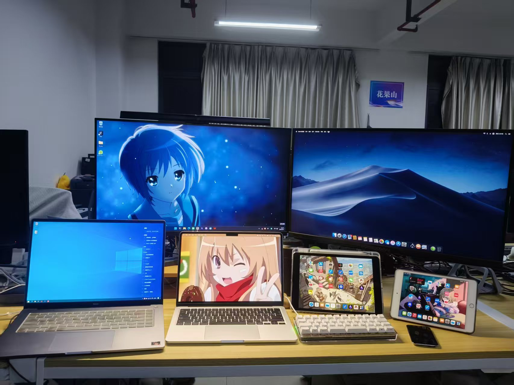
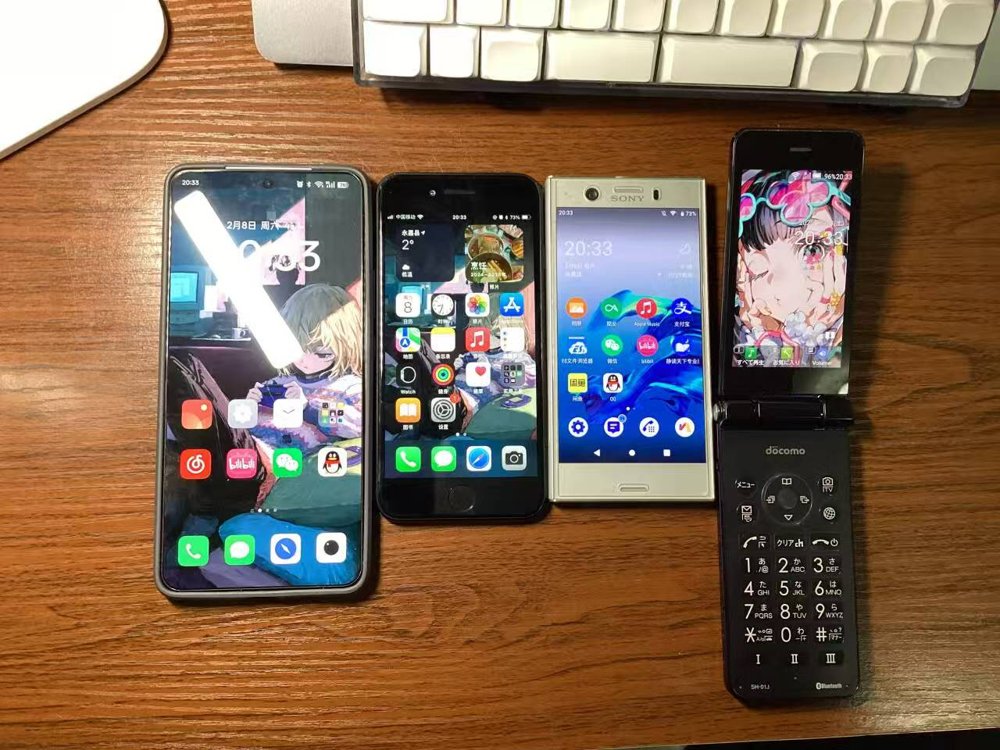
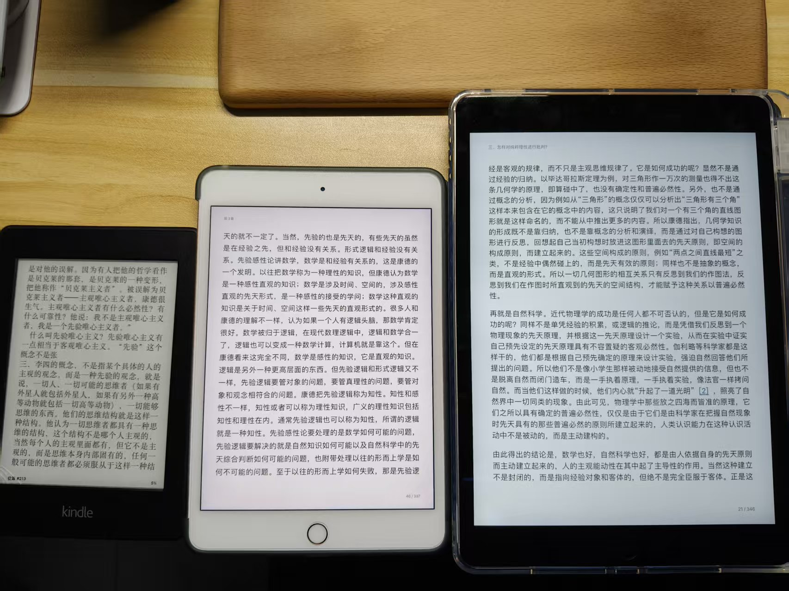

+++
title = 'My Devices'
date = 2026-02-28T08:58:29+08:00
draft = false
+++
A record of the devices I have used, owned, and lost. I love all of them.

## Active
1. MacBook Air (M4, 16GB / 256GB)
2. RedmiBook 15 Pro (2022, Ryzen 7 6800H, 16GB / 512GB)
3. Intel NUC 7 i7BNHXGL
4. Realme Neo 7 (12GB / 256GB)
5. iPad (9th generation, 64GB)
6. iPad mini (5th generation, 64GB)
7. Kindle Paperwhite 2
8. [TU40 (keyboard)](../posts/my-40-percent-keyboard/)
9. Edifier W820NB
10. Vivo TWS 4
11. OPPO Enco Air 3
12. Xiaomi Smart Band 10 NFC
13. Nektar SE25

## Inactive

1. [iPod Touch (4th generation)](../posts/ipod-touch-4/)
2. BlackBerry Bold 9900
3. ASUS Laptop (i5-3210M, 4GB DDR3)
4. iPad (1st generation, 64GB)
5. iPad (2st generation, 16GB)
6. Sony Xperia XZ1 Compact
7. Sharp SH-01J
8. BBK i270
9. 魅蓝 Metal
10. OPPO R9 Plus
11. Nintendo Game Boy Advance

## Past
1. Samsung (Unknown model)
2. Samsung (Unknown model)
3. Samsung Galaxy Note (GT-i9220)
4. Meizu 15 Plus
5. Meizu 16T
6. Redmi K40
7. iPhone SE (3rd generation)
8. Nintendo 3DS
9. 弱水时砂 琉璃
10. 网易云音乐 ME01TWS ×2
11. Redmi AirDots 3 Pro
12. Apple Watch Series 7 (45mm)

## Photo

