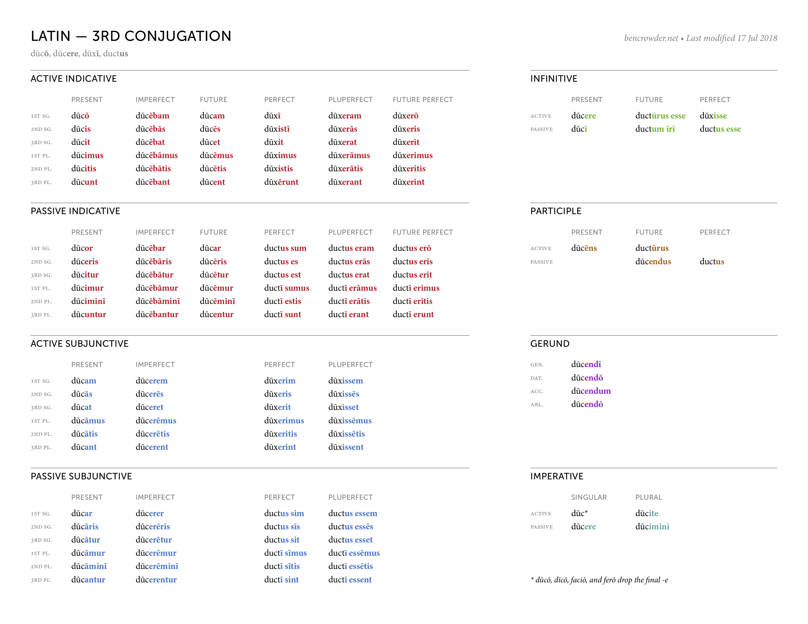
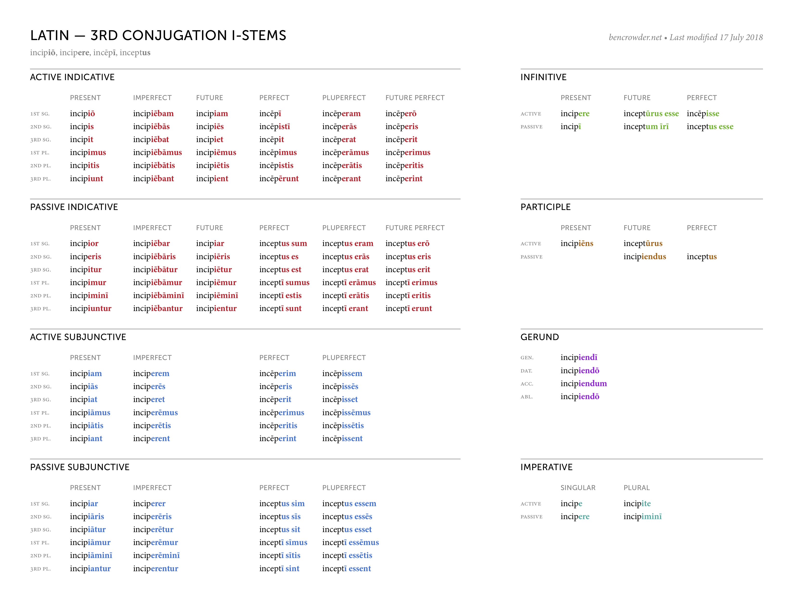
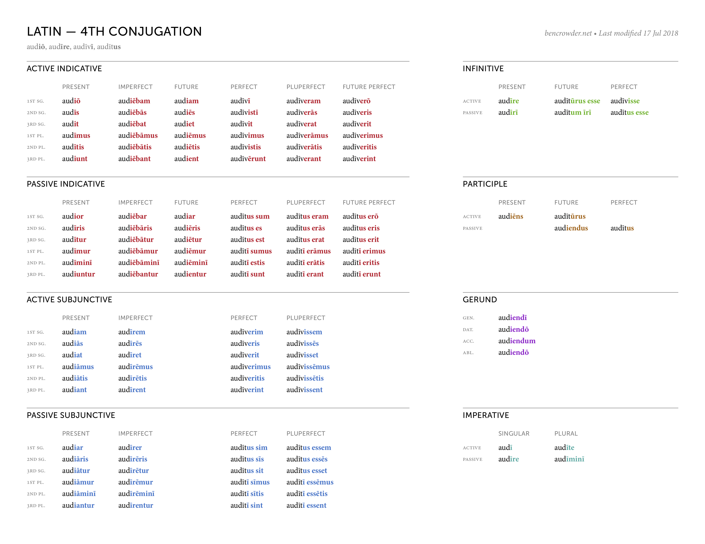
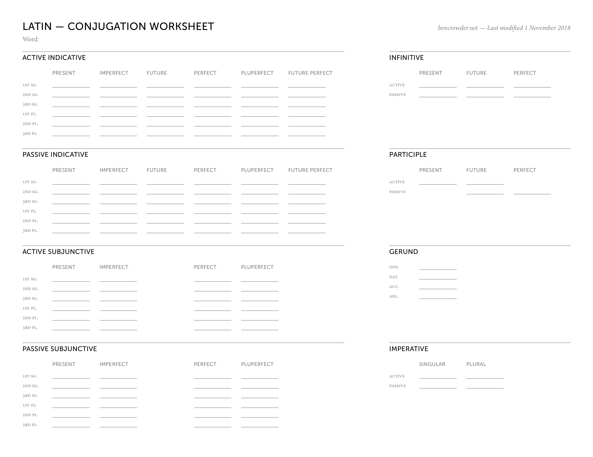
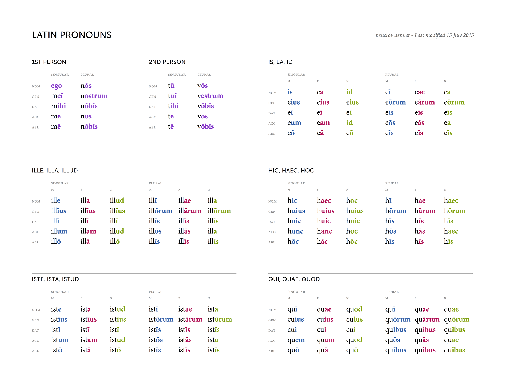

+++
title = 'Latin Charts'
date = 2025-06-22T10:21:00+08:00
draft = false
tags = ["language"]
+++
[conjugations](#conjugations)
[declensions](#declensions)
[pronouns](#pronouns)

# Source
[BenCrowder](https://bencrowder.net/language-charts/)

# Conjugations
### 1st Conjugation

### 2nd Conjugation

### 3rd Conjugation

### 3rd i-stem Conjugation

### 4th Conjugation

### Fill-in-the-Blank Conjugation Worksheet

# Declensions

# Pronouns
