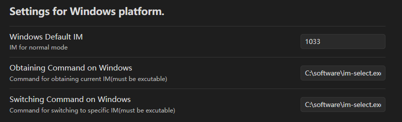

+++
title = ' 在 Windows 平台中切换 Vim 模式时自动切换输入法'
date = 2025-11-15T12:23:58+08:00
draft = false
+++
## 问题
在 Windows 平台使用 **VS Code** 或 **Obsidian** 等软件的 Vim 模式时，若系统当前为中文输入法，进入 Normal 模式后按键命令将被输入法拦截，导致操作失效，极大影响编辑体验。

## 解决方案
主要依靠编辑器与im-select进行联动来进行输入法自动切换，实现在编辑器**进出 Normal 模式时自动切换系统输入法**

## im-select
通过命令切换输入法
项目地址: https://github.com/daipeihust/im-select/
### 用法
#### 获取当前输入法的key
```shell
/path/to/im-select.exe
```

#### 切换输入法
```shell
/path/to/im-select.exe [key]
```

## 输入法配置
切换至英文输入法，在终端中运行 `im-select.exe` ,获得输入法的key

**不能只是在同一个输入法下切换中英文，如果没有英文输入法，可在Windows设置的语言中添加英语，加入英文输入法**

## VS Code
将以下设置加入 `setting.json` :
``` json
    "vim.autoSwitchInputMethod.enable": true,
    "vim.autoSwitchInputMethod.defaultIM": "1033",
    "vim.autoSwitchInputMethod.obtainIMCmd": "C:/software/im-select.exe",
    "vim.autoSwitchInputMethod.switchIMCmd": "C:/software/im-select.exe {im}",
```

配置含义：
| 配置项                | 定义                                                                 |
| ------------------- | -------------------------------------------------------------------- |
| `Default IM`        | 指定normal模式下使用的输入法                                         |
| `Obtaining Command` | 获得当前输入法的命令（必须是可执行的）                               |
| `Switching Command` | 切换当前输入法的命令（必须是可执行的，使用`{im}`来代表输入法的位置） |

## Obsidian
主要依赖 `Vim IM Select` 插件实现

首先确保Obsidian的Vim模式开启
### 插件安装
在社区插件市场搜索 `Vim IM Select` 安装
插件项目主页: https://github.com/ALONELUR/vim-im-select-obsidian/
### 插件配置
Windows 平台下只需要配置 `Settings for Windows platform` 部分
配置项与 `Vs Code`部分相同

例子：

## Vim
在 `.vimrc` 中增加如下内容:
```vim
let g:im_select_path = 'C:\tools\im-select.exe'  " ← 改成实际路径

" 默认英文输入法（1033 = 英语（美国））
let g:default_im = '1033'

" 切换到英文输入法
function! IM_ToEnglish()
    if filereadable(g:im_select_path)
        call system(g:im_select_path . ' ' . g:default_im)
    endif
endfunction

" 离开插入模式 → 强制切英文
autocmd InsertLeave * call IM_ToEnglish()
" 进入插入模式时恢复上次输入法
autocmd InsertEnter * call system(g:im_select_path . ' restore')

" Vim 启动和退出时也切回英文
autocmd VimEnter * call IM_ToEnglish()
autocmd VimLeave * call IM_ToEnglish()

```                
