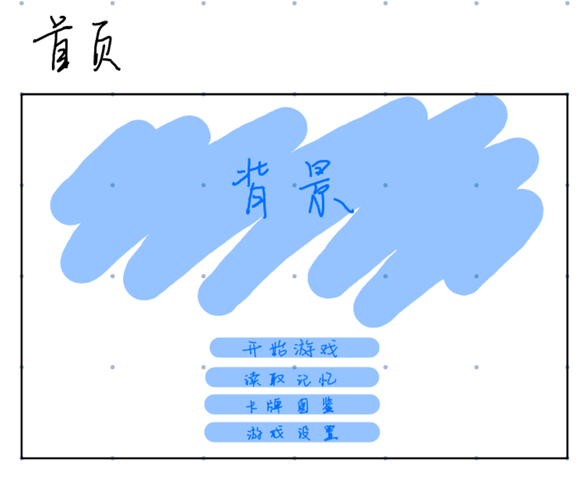
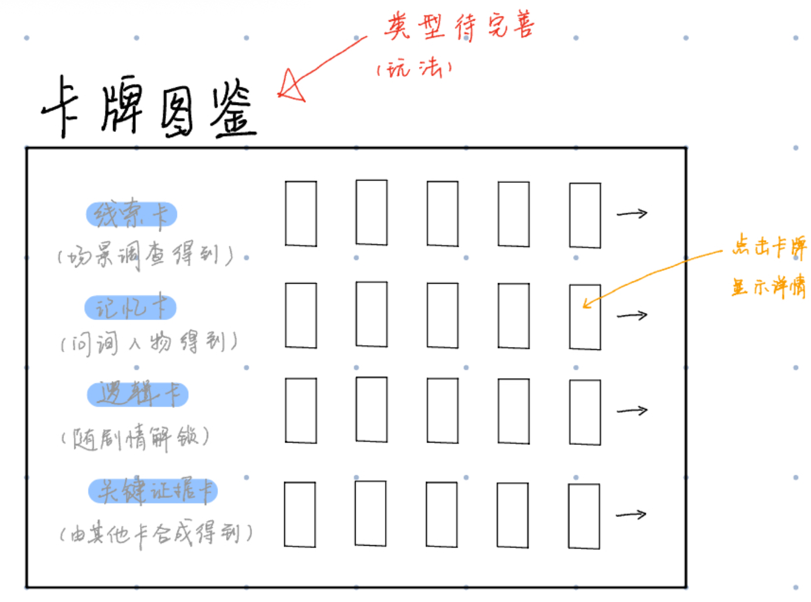
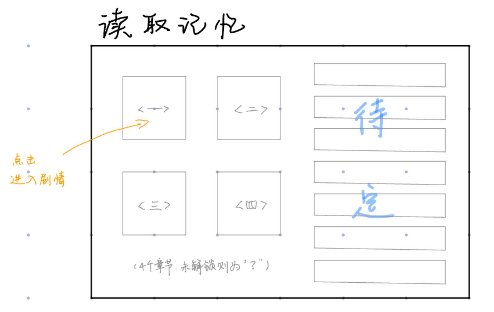
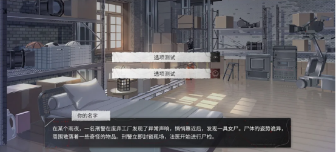
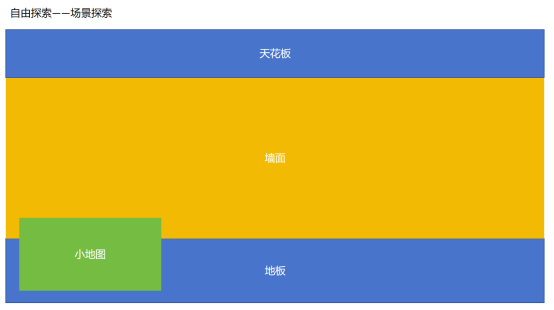
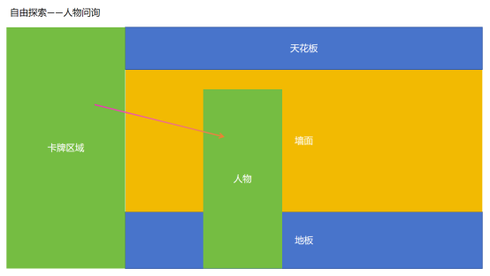

+++
title = '开发规划'
date = 2025-09-21T21:40:54+08:00
draft = true
+++
# 功能界面
## 首页

- 开始游戏
- 读取记忆
- 卡牌图鉴
- 游戏设置
## 卡牌图鉴

## 存档系统

## 设置

# 游戏系统
- 卡牌系统（背包系统）
- 探索系统

# 游戏界面
    2.1. 游戏循环
    章节开始 → 剧情推进 → 自由探索阶段（人物问询+场景探索）→ 卡牌推理环节（整理线索信息）→ 下一章
## 章节开始画面
## 剧情推进

## 探索

## 问询

机制：采用多分支对话树。关键问题需要玩家使用已获得的 “线索卡” 作为“话题”或“证据”进行质问，从而解锁新的对话分支或获得关键信息。
设计要点： 不同角色对同一线索的反应不同，可能撒谎、回避或透露新信息。角色的好感度或信任度会隐性影响其透露信息的多少。

（扔卡牌，吸附，触发线索）