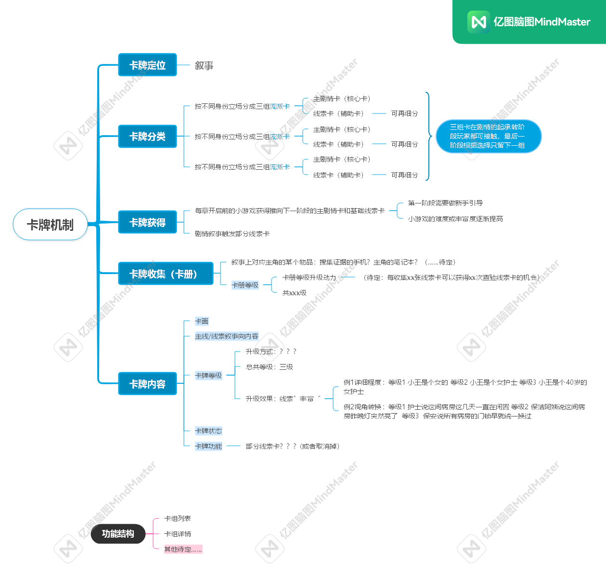
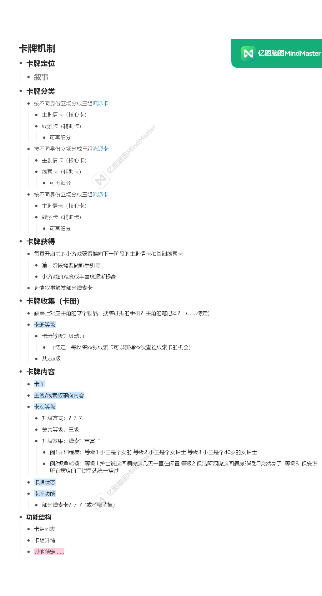

+++
title = '聚光灯GameJam日志'
date = 2025-09-21T21:40:54+08:00
draft = true
+++
# 2025.9.21 初次会议
- 成员自我介绍   
- 2D游戏   
- 游戏形式备选：JRPG，平台跳跃，解谜 (类似纸嫁衣，场景切换，小游戏)
- 引擎：Unity
- 协作：git 使用官方提供的gitignore模板 asset等可能使用lfs

# 2025.9.27 初步策划

# 2025.10.4 策划案初稿
# 2025.10.5 详情页通过申请
https://www.taptap.cn/app/780182

# 2025.10.10 比赛正式开始 