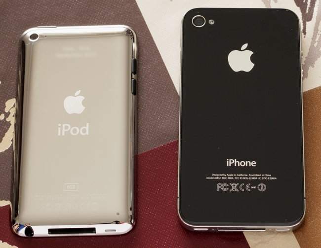
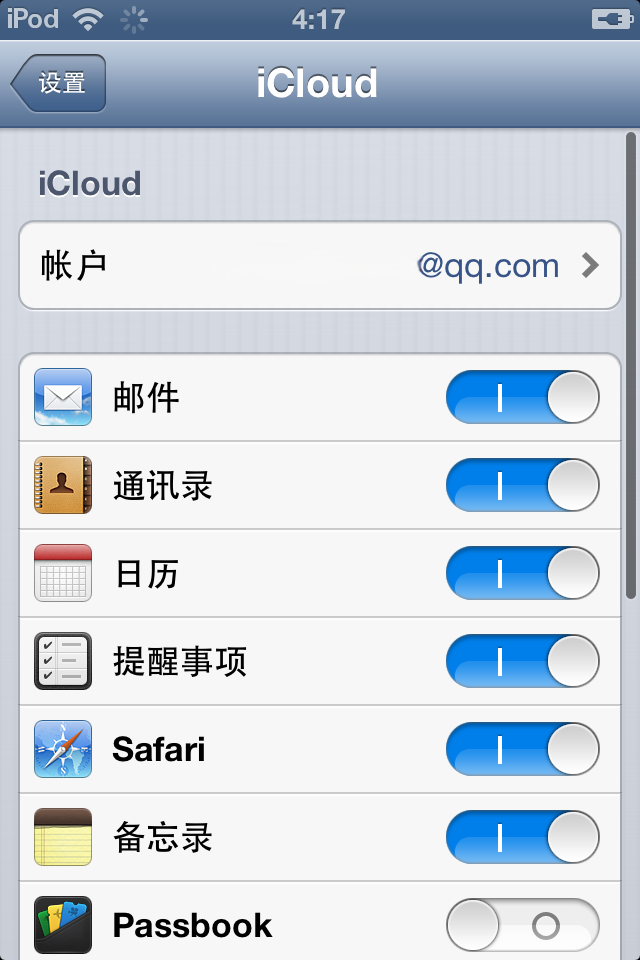
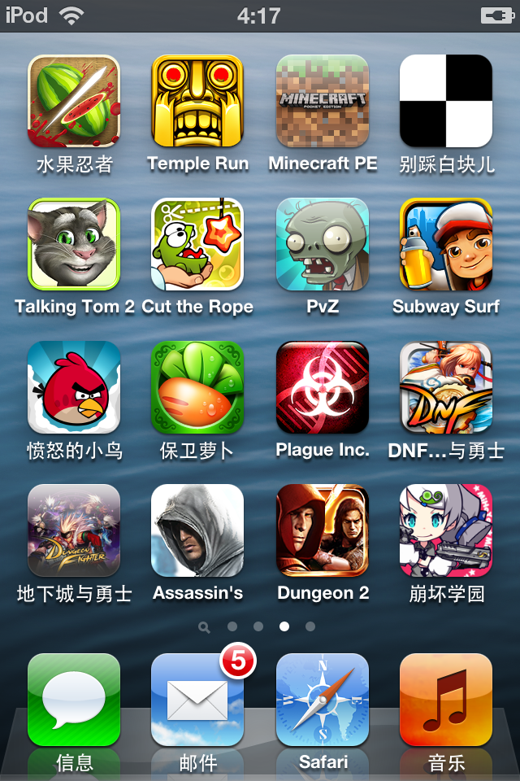
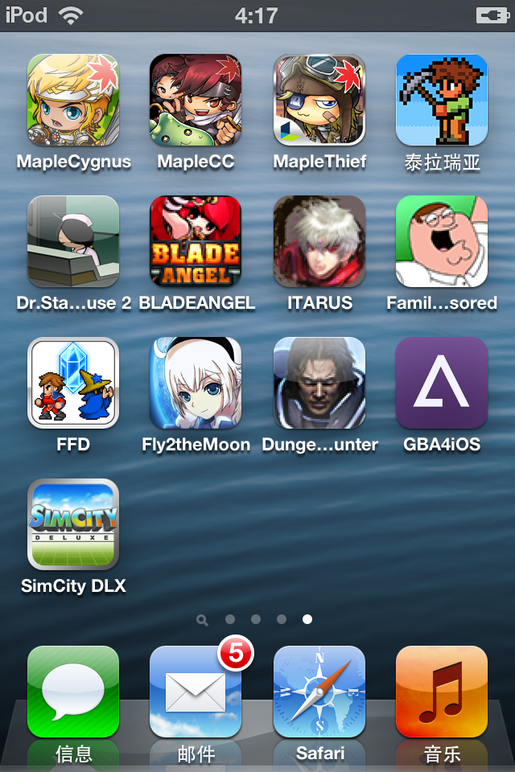
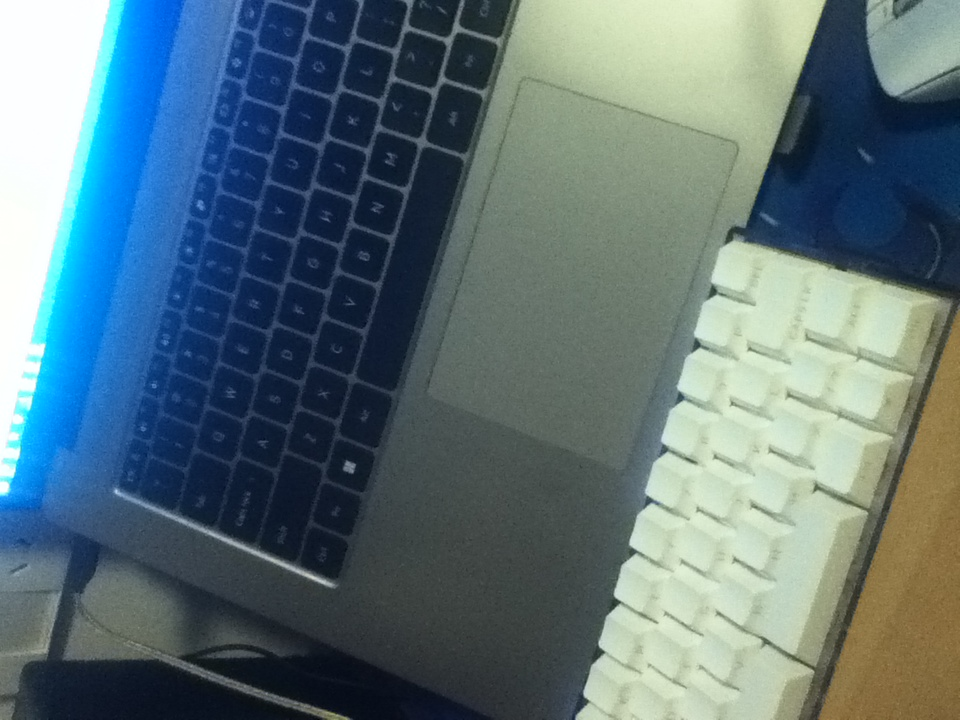
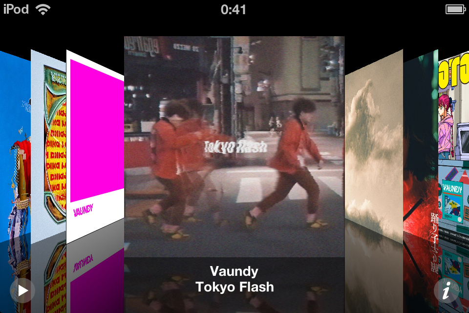
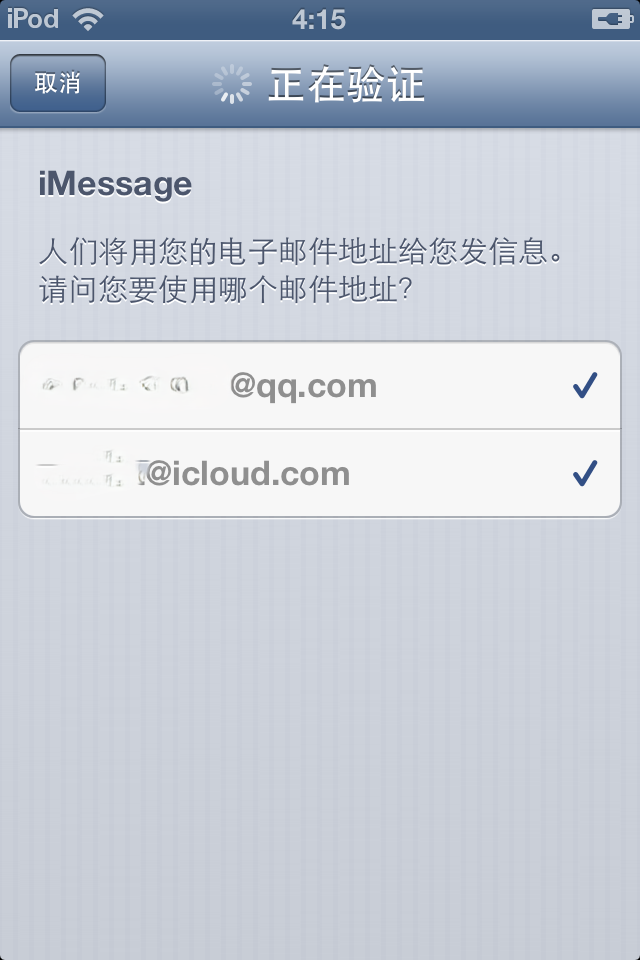

+++
title = 'iPod touch 4'
date = 2026-02-22T16:41:34+08:00
draft = false
+++

## 前言

前几天在手机城闲逛，偶然在一个摊位看到这台 iPod touch 4，让老板拿出来看看，拿上手被它无比的轻薄和精致惊艳到了。iPhone 4 同款 PPI 高达 326 的 Retina 屏在今天依旧看不到明显像素点，同时有着不错的色彩表现。机体相较于 iPhone 4 重量和尺寸小很多，背面是弧面设计的镜面金属，握持感更加舒适的同时整体精致感更强。

很难想象是一台来自十六年前的设备。

图为 iPod touch 4 与 iPhone 4 的背面对比

## 设备概况

- iPod touch 4 (8GB)
- iOS 6.1.6

## iCloud 登录

到手后尝试登录 iCloud 时，弹窗要求输入**二步验证验证码**。另一台设备确实收到了验证码，但 iPod 上没有弹出验证码输入窗口。

### 解决方案

搜索后发现，获取验证码后，**再次登录时将验证码直接附加在密码后面**即可成功登录。

### 同步测试

登录 iCloud 后尝试同步以下项目：
- 日历 - 同步成功
- iMessage - 在信息中登录后可以发送与接收，但不能同步历史消息记录
- 备忘录 - 无效
- Safari 书签 - 无效
- 文稿与数据 - 无效

登录 QQ 邮箱账户可以同步 QQ 邮箱备忘录。

## 越狱

尝试使用爱思助手进行一键越狱，发现爱思助手并不支持 iOS 6.1.6 系统的越狱，同时也无法方便地将系统降级到支持的版本。

### 解决方案
使用 iTunes 11.1.5.5 x64 搭配 p0sixspwn 1.0.8 进行越狱。

### 注意
1. 使用新版本的 iTunes 进行越狱可以开始，但不会推进。
2. iTunes 11.1.5.5 在 Windows 10 上无法成功识别到 iPod，需要使用 Windows 7。
3. 使用 Hyper-V 安装 Windows 7 不支持 USB 设备直通，依旧无法识别 iPod，需要使用 VMware。
4. VMware 现注册博通账号后可免费下载，注册博通账号时使用QQ邮箱和Outlook邮箱均收不到验证码，使用Gmail可以收到，但别人没有遇到这样的问题。

### 工具

1. [iTunes 11.1.5.5 x64 和 p0sixspwn-v1.0.8](https://rubenalamina.mx/custom-installers/downloads/)
2. [Windows 7 直链资源](https://massgrave.dev/windows_7_links)
3. [VMware Workstation Pro 下载教程](https://www.cnblogs.com/EthanS/p/18211302)

### 操作步骤

1. 在 VMware 中安装 Windows 7 虚拟机
2. 安装对应版本的 iTunes 和 p0sixspwn
3. 连接 iPod，**手动配置 USB 直通**
4. 运行 p0sixspwn，按提示操作
5. 设备重启后如与 VMware 断开连接，需**手动重新连接 USB**

### 越狱成功

## Cydia 服务器证书无效

越狱后进入 Cydia 显示**服务器证书无效**。

**解决方案**：
1. 用 Safari 访问 https://tlsroot.litten.ca/
2. 下载并安装证书
3. Cydia 即可正常访问

## 安装第三方 IPA

需要安装两个插件：
- `App Sync`
- `App Sync for iOS 6`

**源地址**：`http://apt.gs/`

现可检索到的大部分 Cydia 源都不可用，在 Cydia 中添加该源后安装上述两个插件，即可通过爱思助手成功安装 IPA 文件。

## IPA 资源推荐

网上大部分 IPA 资源站已停止运营或转为付费，以下是较为可用的几个：

| 网站 | 网址 | 特点 |
|------|------|------|
| iosipa软件网 | https://www.88ipa.com/ | 资源大量且易得，需要积分但赠送的积分很多 |
| Archive | https://archive.org/ | 资源多，搜索麻烦 |
| Archive中的ios4游戏归档 | https://archive.org/details/ios_40_42_ipa | 收录大量 iOS 4 游戏 |
| IPA归档站 | https://ipa.gistwillan.top/ | 资源不少但范围奇怪 |

## 强降级
还未尝试，有教程，需要在 MacOS 上进行操作
- [2025年，如何为iPod touch 4强降级与越狱？](https://www.bilibili.com/video/BV12HAfeCEHN/)

## 图片
### iCloud 账户登录成功

### 安装的应用

### 70万像素后摄的拍摄样张

### CoverFlow (音乐文件用爱思助手手动导入)

### iMessage

## 参考资料
- [2021年，iPod Touch 4 （iOS 6.1.6）越狱记录以及所需文件](https://www.bilibili.com/read/cv11640583/)
- [Question: Help – Cydia Unable to Load Certificate - Reddit](https://www.reddit.com/r/jailbreak/comments/4zh8d4/question_help_cydia_unable_to_load_certificate)