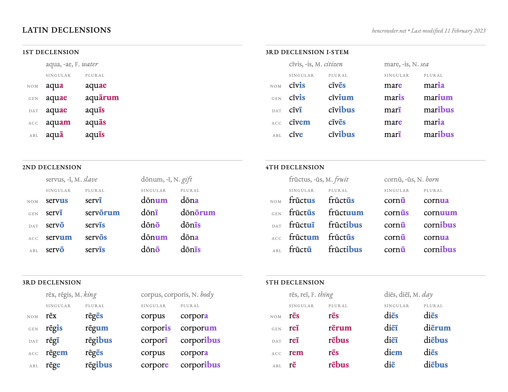

+++
title = 'LTRL Chapter I'
date = 2025-07-08T12:07:12+08:00
draft = false
+++
## Vocabulary

**deus,deī** has certain common irregular forms in the plural.
|Case|Singular|Plural|
|-|-|-|
|Nom./Voc.|deus|dī|
|Gen.|deī|deōrum / deum|
|Dat.|deō|dīs|
|Acc.|deum|deōs|
|Abl.|deō|dīs|
### Prepositions

## Grammar
### The five declensions
|Declension|Genitive Singular Ending|
|--|--|
|1st declension|-ae|
|2st declension|-ī|
|3st declension|-is|
|4st declension|-ūs|
|5st declension|-ei|

To find the steam of any noun, remove the ending from the genitive singular :

Detailed declension : 
