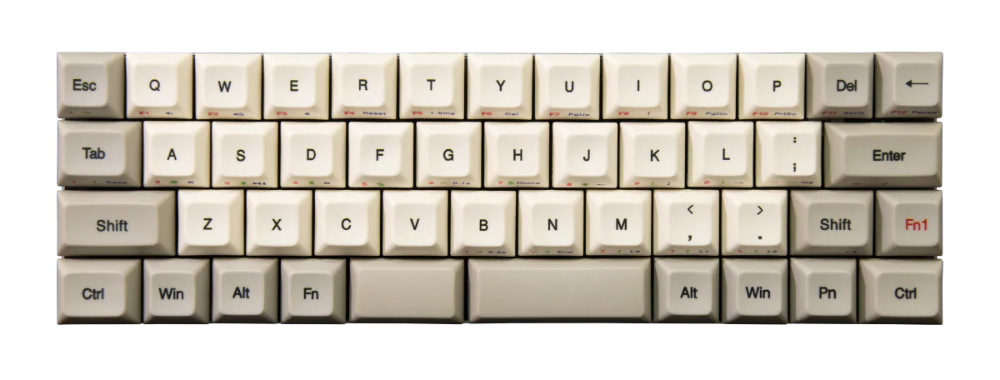
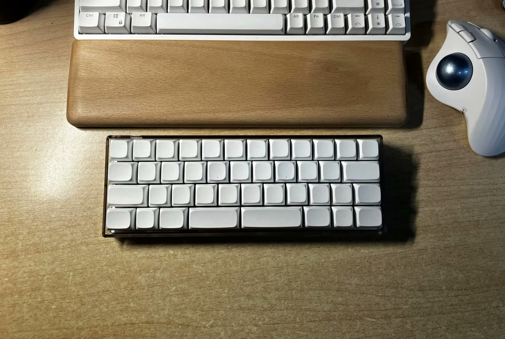
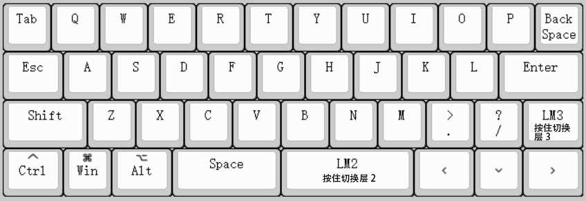
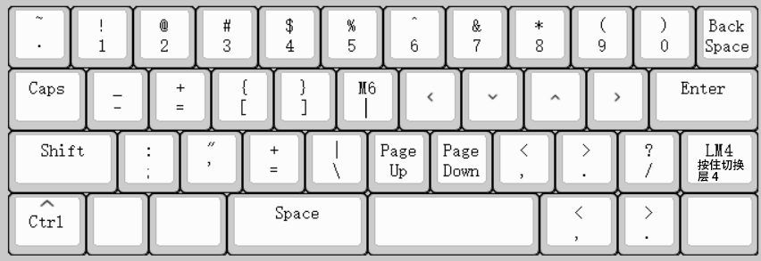
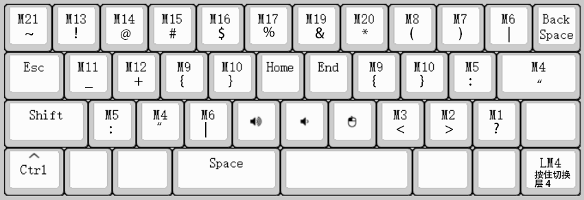
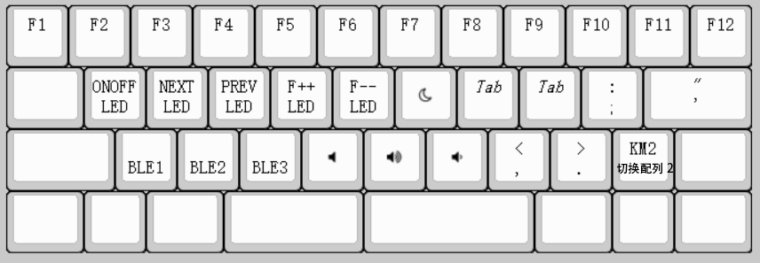

+++
title = '我的40%配列键盘'
date = 2025-10-08T23:36:17+08:00
draft = false
+++
*Less Keys, Less Move*
## Why
这是我看见的第一把40配列键盘：

That's so compact and cute.

因键盘相较鼠标有着更少的不确定性，操作更加可重复和快捷，我倾向于用键盘完成大部分操作，见[Mouseless for Windows](../mouseless-for-windows)。

我一向偏好紧凑的小配列键盘，在此之前我最常使用68配列。

我曾一度认为比68配列的键盘更小的键盘无法正常使用，但Vim改变了我的观念和习惯。

受Vim影响，我倾向于将键盘操作范围收束到26键主键区范围内来减少手部的移动，获得比标准键盘更流畅的输入体验。

同时40配列更加简洁，便携且节省桌面空间。
## How
通过多层键位映射（layers）来弥补物理按键的缺失，具体配置见下文[Keymap](#keymap)。

## Build
- 套件: [TU40](https://item.taobao.com/item.htm?abbucket=2&id=634677914967&mi_id=0000xG7CdSadRnw59SsswuU0a4Cvzd_s5a4qnEnPYwAYLjk&ns=1&priceTId=2150483517599402182825041e10a7&skuId=5618860163455&spm=a21n57.1.hoverItem.1&utparam=%7B%22aplus_abtest%22%3A%22a9ab0e7e453e6dd50475ef18c3d6eac8%22%7D&xxc=taobaoSearch) 有线蓝牙双模
- 轴体: 水蜜桃V3

因为喜欢触发力度轻的键盘，我将所有轴体的弹簧更换成了25g的定制弹簧，省力的同时也有助于降低腱鞘炎等手部劳损的风险。

键盘高度较高，搭配木质手托使用更舒适。

## Keymap
### Layer 1

默认层，`ESC` 在Vim中较为常用，所以将占据着极其便捷位置的 `Caps Lock` 替换为 `ESC`
### Layer 2

按住右空格触发，主要设有数字和常用符号

`h`, `j` ,`k` ,`l` 仿照Vim设置为 `Left`, `Down`, `Up`, `Right`
### Layer 3

按住原右Shift触发，主要设有需要shift的符号
### Layer 4

按住原右Shift后再按住原右Ctrl触发，主要设有F区和部分键盘功能键
- BLE1: 切换蓝牙设备1
- BLE2: 切换蓝牙设备2
- BLE3: 切换蓝牙设备3
- ONOFF LED: 开关LED背光
- NEXT LED: 下一个LED背光动效
- PREV LED: 上一个LED背光动效
- F++ LED: 提高LED背光亮度
- F-- LED: 降低LED背光亮度